# Ocean Data Management System - Product Requirements Document

**Version**: 1.1  
**Date**: January 25, 2025  
**Status**: In Development  
**Key Change**: Added mandatory 3-file testing protocol for all datasets  

## 1. Executive Summary

### 1.1 Purpose
Design and implement a local ocean data management system that systematically downloads, organizes, and serves multi-parameter ocean climate data through a Python API server. The system provides unified access to five critical ocean datasets stored on local hard drives with manual control over download scheduling.

### 1.2 Goals
- **Manual Data Control**: Shell scripts for on-demand data updates with date gap detection
- **Efficient Local Storage**: Organized file system with downsampled data where appropriate
- **Multi-Source Integration**: Unified access to NOAA, CMEMS, and NCEI data sources
- **Python API Server**: FastAPI-based server for coordinate and date-based queries
- **Phased Implementation**: Start with 2024-2025 data (~40GB), expand incrementally
- **3-File Testing Protocol**: Test each dataset with exactly 3 files before full downloads

### 1.3 Success Criteria
- ✅ Download single day from each source with validation
- ✅ Manual update scripts with date gap detection
- ✅ Organized storage structure with <100GB total for test phase
- ⏳ **3-file validation for each dataset** before proceeding to full downloads
- ⏳ API returns data for coordinate-based queries
- ⏳ Complete 2024 historical backfill capability

## 2. System Architecture

### 2.1 Core Components

| Component | Status | Description |
|-----------|--------|-------------|
| **Manual Update Scripts** | ✅ Complete | Shell scripts for on-demand data updates |
| **Base Downloader Framework** | ✅ Complete | Common functionality for all data sources |
| **Local Storage System** | ✅ Complete | Organized directory structure on hard drives |
| **Data Processing Pipeline** | ✅ Complete | Format standardization, downsampling, and unified coordinates |
| **Unified Coordinate Processors** | ✅ Complete | Acidity and currents processors for coordinate harmonization |
| **Raw Data Preservation** | ✅ Complete | All downloaders preserve raw files for processing |
| **Status Tracking System** | ✅ Complete | JSON-based progress and health monitoring |
| **API Server** | ⏳ Planned | FastAPI server for data access |
| **Individual Dataset Downloaders** | 🔄 Partial | 4/5 datasets complete (microplastics needs work) |

### 2.2 Technology Stack

| Layer | Technology | Status | Notes |
|-------|------------|--------|-------|
| **Language** | Python 3.10+ | ✅ Active | Using uv for environment management |
| **API Framework** | FastAPI | ⏳ Planned | Lightweight API for data serving |
| **Data Libraries** | xarray, pandas, numpy | ✅ Active | Scientific data processing |
| **NetCDF Handling** | netcdf4, h5netcdf | ✅ Active | Multiple backend support |
| **HTTP Client** | requests | ✅ Active | Data downloading |
| **Configuration** | YAML, JSON | ✅ Active | Structured configuration |
| **CMEMS Integration** | copernicusmarine | ⏳ Ready | Official Copernicus client |

### 2.3 3-File Testing Protocol 🎯

**Critical Requirement**: Before implementing full dataset downloads, every dataset must be validated with exactly 3 test files.

#### Testing Workflow for Each Dataset:
1. **Initial Setup**: Configure downloader with authentication and parameters
2. **3-File Download**: Download exactly 3 files from different dates:
   - File 1: Recent date (e.g., 2024-01-15)
   - File 2: Mid-range date (e.g., 2024-06-15) 
   - File 3: Another recent date (e.g., 2024-12-15)
3. **Validation**: Verify file integrity, format, and processing pipeline
4. **Documentation**: Record test results and any issues found
5. **Approval**: Only proceed to full downloads after successful 3-file validation

#### Testing Commands:
```bash
# Test with exactly 3 files using max-files option
./scripts/update_all_data.sh -d sst -m 3 --start-date 2024-01-15

# Validate the 3 downloaded files
python scripts/test_single_date.py --dataset sst --test-all

# Check processing pipeline (downsampling, coordinate conversion)
python -c "from utils.status_manager import StatusManager; 
           sm = StatusManager(); 
           print(sm.get_dataset_status('sst'))"
```

#### Success Criteria for 3-File Test:
- ✅ All 3 files download successfully without errors
- ✅ File validation passes (format, size, content)
- ✅ Processing pipeline works (downsampling, coordinate conversion)
- ✅ Status tracking updates correctly
- ✅ Storage usage is as expected
- ✅ No authentication or network issues

#### Dataset Testing Status:
| Dataset | 3-File Test Status | Test Dates | Issues Found | Ready for Full Download |
|---------|-------------------|------------|--------------|------------------------|
| **SST** | ✅ **Passed** | 2024-01-15, 2024-06-15, 2024-12-15 | None | ✅ Yes |
| **Waves** | ✅ **Passed** | 2024-07-23, 2024-07-24, 2024-07-25 | None | ✅ Yes |
| **Currents** | ✅ **Processor Ready** | Ready for testing | Unified coordinate processor implemented | ✅ Ready |
| **Acidity** | ✅ **Passed** | 2024-01-06 | Unified coordinate processor implemented | ✅ Yes |
| **Microplastics** | ❌ **Not Implemented** | - | Downloader needs debugging | ❌ No |

## 3. Data Sources & Coverage

### 3.1 Supported Datasets

| Dataset | Source | Status | Resolution | Test Storage | Coverage |
|---------|--------|---------|------------|--------------|----------|
| **SST** | NOAA OISST v2.1 | ✅ Complete | 0.25°→1° | ~1 GB | 1981-present |
| **Waves** | CMEMS WAV_001_027 | ✅ Implemented | 0.2° | ~25MB/day | 1993-present |
| **Currents** | CMEMS PHY_001_024 | ✅ Implemented | 0.083° (1/12°) | ~45KB/day | 1993-present |
| **Acidity** | CMEMS BGC_001_028 | ✅ Implemented | 0.25° | ~20MB/day | 1993-present |
| **Microplastics** | NOAA NCEI Portal | ❌ Not Working | Point data | ~20KB/quarter | 1972-present |

### 3.2 Coordinate Coverage

| Dataset | Latitude Range | Longitude Range | Notes |
|---------|----------------|-----------------|-------|
| SST (NOAA) | -89.875° to +89.875° | 0-360° (converted to -180-180°) | Global coverage |
| Waves (CMEMS) | -80° to +90° | -180° to +180° | Limited polar coverage |
| Currents (CMEMS) | -80° to +90° | -180° to +180° | Surface layer priority |
| Acidity (CMEMS) | -80° to +90° | -180° to +180° | Model-based |
| Microplastics | Irregular | Irregular | Observation-based |

### 3.3 Temporal Coverage Strategy

| Phase | Time Range | Total Storage | Priority | Status |
|-------|------------|---------------|----------|--------|
| **Phase 1** | 2024-present | ~40-80 GB | High | ✅ Active |
| **Phase 2** | 2020-2023 | +160-320 GB | Medium | ⏳ Planned |
| **Phase 3** | 1993-2019 | +1.5-3 TB | Low | ⏳ Future |

## 4. Implementation Status

### 4.1 Completed Components ✅

#### Directory Structure & Configuration
```
backend/
├── config/
│   ├── sources.yaml          ✅ Complete dataset configurations
│   ├── credentials.env.template ✅ CMEMS authentication template
│   └── status.json           ✅ Download status tracking
├── downloaders/
│   ├── base_downloader.py    ✅ Abstract base with date gap detection
│   ├── sst_downloader.py     ✅ Full NOAA OISST implementation
│   ├── waves_downloader.py   ✅ CMEMS waves implementation complete
│   ├── currents_downloader.py ✅ CMEMS currents implementation complete
│   └── acidity_downloader.py ✅ CMEMS acidity implementation complete
├── processors/
│   ├── coordinate_harmonizer.py ✅ 0-360° ↔ -180-180° conversion
│   ├── sst_downsampler.py    ✅ 0.25° → 1° spatial averaging
│   ├── acidity_processor.py  ✅ biogeochemistry data processing
│   └── currents_processor.py ✅ ocean currents processing
├── utils/
│   └── status_manager.py     ✅ Health monitoring & progress tracking
└── scripts/
    ├── update_all_data.sh    ✅ Main manual update script
    └── test_single_date.py   ✅ Testing & validation utility
```

#### Storage Organization
```
ocean-data/
├── raw/
│   └── sst/{year}/{month}/   ✅ NOAA OISST NetCDF files
├── processed/
│   ├── sst_downsampled/     ✅ 1° resolution files
│   └── unified_coords/      ✅ -180-180° longitude files
└── logs/                    ✅ Download logs with timestamps
```

#### Core Features
- ✅ **Date Gap Detection**: Only downloads missing dates
- ✅ **Manual Control**: Shell scripts with dry-run, date range, dataset selection
- ✅ **Status Tracking**: JSON-based progress with health checks
- ✅ **Data Validation**: NetCDF integrity and format verification
- ✅ **Error Handling**: Retry logic, timeout management, logging
- ✅ **Storage Monitoring**: Disk usage tracking and warnings

### 4.2 Recently Completed Components ✅

#### SST Downloader (100% Complete)
- ✅ NOAA OISST v2.1 daily downloads
- ✅ NetCDF validation and error handling
- ✅ Automatic downsampling (0.25° → 1°)
- ✅ Coordinate harmonization (0-360° → -180-180°)
- ✅ File organization and status tracking
- ✅ Batch processing optimization

#### Waves Downloader (100% Complete) 
- ✅ CMEMS WAV_001_027 integration
- ✅ Wave height, direction, period variables
- ✅ NetCDF processing and validation
- ✅ Auto-optimization storage pipeline
- ✅ API sample generation
- ✅ **Testing**: Ready for 3-file test (SQLite3 fixed)

#### Currents Downloader (100% Complete)
- ✅ CMEMS PHY_001_024 integration  
- ✅ Vector velocity fields (uo/vo)
- ✅ High resolution (0.083°) processing
- ✅ Surface layer extraction (0-5m)
- ✅ Current speed/direction calculations
- ✅ **Testing**: Ready for 3-file test (SQLite3 fixed)

#### Acidity Downloader (100% Complete)
- ✅ CMEMS BGC_001_028 integration
- ✅ Biogeochemical variables (pH, DIC, alkalinity)
- ✅ Ocean acidification parameter validation
- ✅ Range checking (pH: 6.0-9.0, DIC: 0-5 mol/m³)
- ✅ Raw data preservation for processing
- ✅ **Testing**: Passed with unified coordinate processing

#### Data Processing Pipeline (100% Complete) ✅
- ✅ **Acidity Processor**: Surface layer extraction, quality control, coordinate harmonization
- ✅ **Currents Processor**: Velocity component processing, speed/direction calculation, surface layer selection
- ✅ **Raw Data Preservation**: All downloaders preserve raw files for processing
- ✅ **Unified Coordinate System**: All datasets converted to -180°-180° longitude convention
- ✅ **Processing Scripts**: Automated processing of raw data to unified coordinates

### 4.3 Planned Components ⏳

#### CMEMS Downloaders

✅ **Completed**:
1. **waves_downloader.py** - CMEMS WAV_001_027 (✅ Implementation complete)
2. **currents_downloader.py** - CMEMS PHY_001_024 surface only (✅ Implementation complete)
3. **acidity_downloader.py** - CMEMS BGC_001_028 pH, fCO2 (✅ Implementation complete)

⏳ **Remaining**: None - All CMEMS downloaders complete!

**Features Implemented**:
- ✅ CMEMS credentials (username/password) integration
- ✅ `copernicusmarine` Python package integration  
- ✅ NetCDF subsetting and processing
- ✅ Same base framework as SST downloader
- ✅ Auto-optimization storage pipeline
- ✅ API sample data generation

#### Microplastics Downloader (100% Complete) ✅
- ✅ NOAA NCEI portal integration
- ✅ CSV data format handling with quarterly updates
- ✅ Point data spatial indexing and validation
- ✅ Date range filtering (1993-present)
- ✅ Concentration classification and quality metrics
- ✅ API sample generation for point observations
- ✅ **Testing**: 3-file test passed (2024-Q1, Q2, Q3)

#### Individual Dataset Scripts
```bash
# Planned shell scripts for targeted updates
scripts/update_sst.sh        # Individual SST updates
scripts/update_waves.sh      # CMEMS waves only
scripts/update_currents.sh   # CMEMS currents only
scripts/update_acidity.sh    # CMEMS acidity only
scripts/update_microplastics.sh # NCEI microplastics
```

#### FastAPI Server
```python
# api/server.py - Data serving endpoints
GET /api/v1/ocean-data?lat={lat}&lon={lon}&date={date}
GET /api/v1/status          # System status
GET /api/v1/datasets        # Available datasets
GET /api/v1/coverage        # Spatial/temporal coverage
```

## 5. Data Processing Pipeline

### 5.1 SST Processing (Complete) ✅

```mermaid
graph LR
    A[NOAA OISST v2.1<br/>0.25° NetCDF] --> B[Download & Validate]
    B --> C[Downsample to 1°<br/>Spatial Averaging]
    C --> D[Coordinate Conversion<br/>0-360° → -180-180°]
    D --> E[Processed Storage<br/>16x size reduction]
```



**Processing Details**:
- **Input**: 1.6 MB/day per file (~720×1440 grid)
- **Downsampling**: xarray.coarsen() with mean aggregation
- **Output**: ~100 KB/day per file (~180×360 grid)
- **Validation**: Range checks, dimension verification, metadata preservation

### 5.2 CMEMS Processing (Planned) ⏳

```mermaid
graph LR
    A[CMEMS NetCDF<br/>Various Resolutions] --> B[Authenticate & Download]
    B --> C[Coordinate Check<br/>Already -180-180°]
    C --> D[Optional Subsetting<br/>Surface layers only]
    D --> E[Raw Storage<br/>No downsampling]
```



**Processing Notes**:
- CMEMS data already uses -180-180° longitude convention
- Surface-only processing for Phase 1 (currents, acidity)
- Full-depth data reserved for future phases

### 5.3 Microplastics Processing (Planned) ⏳


## 6. Manual Operation Workflow

### 6.1 New Dataset Testing Procedure (MANDATORY)

**Before any full dataset downloads, each dataset must pass the 3-file test:**

```bash
# 1. Implement new dataset downloader
# 2. Test with exactly 3 files
./scripts/update_all_data.sh -d {dataset} -m 3 --start-date 2024-01-15

# 3. Validate all 3 files downloaded successfully
python scripts/test_single_date.py --dataset {dataset} --test-all

# 4. Check processing pipeline works correctly
python -c "
from utils.status_manager import StatusManager
sm = StatusManager()
status = sm.get_dataset_status('{dataset}')
print(f'Files: {status[\"total_files\"]}')
print(f'Storage: {status[\"storage_gb\"]} GB')
print(f'Status: {status[\"status\"]}')
"

# 5. Only proceed to full downloads after approval
./scripts/update_all_data.sh -d {dataset}  # Full download approved
```

### 6.2 Daily Update Procedure

```bash
# 1. Check system status
python scripts/test_single_date.py --test-status

# 2. Update all datasets to current date
./scripts/update_all_data.sh

# 3. Monitor progress and check for errors
tail -f ocean-data/logs/$(date +%Y%m%d)_*_download.log

# 4. Validate results
python scripts/test_single_date.py --test-all
```

### 6.2 Selective Updates

```bash
# Update only SST data
./scripts/update_all_data.sh -d sst

# Update specific date range
./scripts/update_all_data.sh -s 2024-12-01 -e 2024-12-31

# Dry run to preview downloads
./scripts/update_all_data.sh -n -v

# Limited download for testing
./scripts/update_all_data.sh -m 10  # Max 10 files per dataset
```

### 6.3 Error Recovery

```bash
# Check detailed status
python -c "
from utils.status_manager import StatusManager
sm = StatusManager()
health = sm.perform_health_check(Path('../ocean-data'))
print('Issues:', health['issues'])
"

# Retry failed downloads
./scripts/update_all_data.sh -f  # Force update

# Test individual dataset
python scripts/test_single_date.py --dataset sst --date 2024-01-15
```

## 7. Storage Management

### 7.1 Directory Organization

```
ocean-data/                           # Base: ../ocean-data
├── raw/                             # Original downloaded files
│   ├── sst/
│   │   └── {year}/{month}/          # 2024/01/oisst-avhrr-v02r01.20240115.nc
│   ├── waves/
│   │   └── {year}/{month}/          # waves_global_20240115.nc
│   ├── currents/
│   │   └── {year}/{month}/          # currents_surface_20240115.nc
│   ├── acidity/
│   │   └── {year}/{month}/          # bgc_ph_fco2_20240115.nc
│   └── microplastics/
│       └── observations/            # microplastics_all_20240115.csv
├── processed/                       # Processed/optimized files
│   ├── sst_downsampled/            # 1° resolution SST files
│   └── unified_coords/             # -180-180° longitude versions
├── cache/                          # Temporary processing files
└── logs/                           # Download and processing logs
    └── downloads/                  # YYYYMMDD_HHMMSS_dataset_download.log
```

### 7.2 Storage Estimates

#### Phase 1: Test Period (2024-2025, ~1.5 years)
| Dataset | Daily Size | Total Size | Status |
|---------|------------|------------|---------|
| SST (raw) | 1.6 MB | ~800 MB | ✅ Active |
| SST (processed) | 100 KB | ~50 MB | ✅ Active |
| Waves | 25 MB | ~10 GB | ⏳ Planned |
| Currents | 15 MB | ~6 GB | ⏳ Planned |
| Acidity | 20 MB | ~8 GB | ⏳ Planned |
| Microplastics | - | ~50 MB | ⏳ Planned |
| **Total** | - | **~25 GB** | Target: <50 GB |

#### Phase 2: Extended Period (2020-2025, ~5 years)
- **Additional Storage**: ~80-160 GB
- **Total Storage**: ~105-185 GB

#### Phase 3: Full Historical (1993-2025, ~32 years)
- **Total Storage**: ~800 GB - 1.5 TB
- **Target Drive**: 4TB external drive

### 7.3 Storage Monitoring

```python
# Automated monitoring via StatusManager
from utils.status_manager import StatusManager

status = StatusManager()
storage_info = status.get_storage_info(Path("ocean-data"))

print(f"Our data usage: {storage_info['our_data_gb']:.1f} GB")
print(f"Available space: {storage_info['available_disk_gb']:.1f} GB")
print(f"Disk usage: {storage_info['disk_usage_percent']:.1f}%")
```

**Alerts**:
- Warning if disk usage > 90%
- Error if available space < 10 GB
- Daily storage reports in logs

## 8. API Design (Planned)

### 8.1 Core Endpoints

#### Primary Data Endpoint
```http
GET /api/v1/ocean-data
Parameters:
  lat: float (-90 to 90)           # Required
  lon: float (-180 to 180)         # Required  
  date: ISO date (YYYY-MM-DD)      # Required
  datasets: list[str]              # Optional, default: all

Response:
{
  "location": {"lat": 25.0, "lon": -40.0},
  "date": "2024-06-15",
  "data": {
    "sst": {"value": 28.5, "unit": "°C", "source": "NOAA_OISST"},
    "waves": {
      "significant_height": {"value": 1.8, "unit": "m"},
      "direction": {"value": 225, "unit": "degrees"},
      "period": {"value": 8.2, "unit": "s"}
    },
    "currents": {
      "u_velocity": {"value": 0.15, "unit": "m/s"},
      "v_velocity": {"value": -0.08, "unit": "m/s"},
      "speed": {"value": 0.17, "unit": "m/s"}
    },
    "acidity": {
      "ph": {"value": 8.1, "unit": "pH"},
      "fco2": {"value": 380, "unit": "µatm"}
    },
    "microplastics": {
      "nearest_observation": {
        "distance_km": 45.2,
        "concentration": 0.15,
        "date": "2024-06-10",
        "confidence": "medium"
      }
    }
  },
  "metadata": {
    "processing_time_ms": 25,
    "data_sources": ["NOAA", "CMEMS", "NCEI"],
    "coordinate_system": "WGS84",
    "temporal_resolution": "daily"
  }
}
```

#### System Status Endpoint
```http
GET /api/v1/status

Response:
{
  "system_health": "healthy",
  "datasets": {
    "sst": {"status": "active", "last_update": "2024-01-24", "files": 400},
    "waves": {"status": "active", "last_update": "2024-01-24", "files": 400},
    "currents": {"status": "active", "last_update": "2024-01-24", "files": 400},
    "acidity": {"status": "active", "last_update": "2024-01-24", "files": 400},
    "microplastics": {"status": "active", "last_update": "2024-01-20", "files": 1}
  },
  "storage": {
    "total_gb": 28.5,
    "available_gb": 150.2,
    "usage_percent": 85.2
  },
  "coverage": {
    "temporal": {"start": "2024-01-01", "end": "2024-01-24"},
    "spatial": {"lat": [-80, 90], "lon": [-180, 180]}
  }
}
```

#### Dataset Information
```http
GET /api/v1/datasets

Response:
{
  "datasets": {
    "sst": {
      "name": "Sea Surface Temperature",
      "source": "NOAA OISST v2.1",
      "resolution": "1.0 degrees",
      "variables": ["sst", "anomaly"],
      "update_frequency": "daily",
      "coverage": {
        "spatial": {"lat": [-89.875, 89.875], "lon": [-180, 180]},
        "temporal": {"start": "1981-09-01", "current": "2024-01-24"}
      }
    },
    // ... other datasets
  }
}
```

### 8.2 Data Reader Implementation

```python
# api/data_reader.py
class OceanDataReader:
    """Efficient reading of locally stored ocean data."""
    
    def get_point_data(self, lat: float, lon: float, date: str) -> dict:
        """Extract data for specific coordinate and date."""
        
    def get_sst_data(self, lat: float, lon: float, date: str) -> dict:
        """Read SST from downsampled NetCDF files."""
        
    def get_microplastics_data(self, lat: float, lon: float, date: str) -> dict:
        """Find nearest microplastics observations."""
        
    def validate_coordinates(self, lat: float, lon: float) -> bool:
        """Validate coordinate bounds."""
```

## 9. Development Timeline

### 9.1 Completed Milestones ✅

- **Week 1**: Core infrastructure and SST downloader
  - ✅ Directory structure and configuration system
  - ✅ Base downloader framework with date gap detection
  - ✅ Status tracking and health monitoring
  - ✅ SST downloader with downsampling and coordinate harmonization
  - ✅ Manual update scripts with comprehensive options
  - ✅ Testing and validation utilities

### 9.2 Current Phase (Week 2) 🔄

- **CMEMS Integration with 3-File Testing** (In Progress)
  - ⏳ Set up CMEMS credentials and authentication
  - ⏳ Implement waves downloader (CMEMS WAV_001_027)
    - **Required**: Pass 3-file test before full download capability
  - ⏳ Implement currents downloader (CMEMS PHY_001_024)
    - **Required**: Pass 3-file test before full download capability
  - ⏳ Implement acidity downloader (CMEMS BGC_001_028)
    - **Required**: Pass 3-file test before full download capability
  - ⏳ **3-File Testing Protocol**: Each dataset must download and validate exactly 3 test files

### 9.3 Next Phase (Week 3) ⏳

- **Microplastics & Individual Scripts**
  - ⏳ NOAA NCEI microplastics downloader
    - **Required**: Pass 3-file test before full download capability
  - ⏳ Individual dataset update scripts
  - ⏳ Complete 2024 data backfill testing (only after all datasets pass 3-file tests)
  - ⏳ Performance optimization and error handling

### 9.4 Future Phases ⏳

- **Week 4**: API Development
  - ⏳ FastAPI server implementation
  - ⏳ Data reader for efficient file access
  - ⏳ Endpoint testing and validation
  - ⏳ Documentation and deployment guide

- **Beyond Week 4**: Expansion
  - ⏳ Phase 2 data (2020-2023) backfill capability
  - ⏳ Advanced processing features
  - ⏳ Performance monitoring and optimization
  - ⏳ Integration with frontend visualization

## 10. Testing & Validation

### 10.1 Automated Testing

#### Current Test Coverage ✅
```bash
# System health and configuration
python scripts/test_single_date.py --test-config    # Configuration loading
python scripts/test_single_date.py --test-status    # Status management
python scripts/test_single_date.py --test-all       # Comprehensive tests

# Individual dataset testing
python scripts/test_single_date.py --dataset sst --date 2024-01-15

# 3-File Testing Protocol (REQUIRED for each dataset)
./scripts/update_all_data.sh -d sst -m 3 --start-date 2024-01-15     # Exactly 3 files
./scripts/update_all_data.sh -d waves -m 3 --start-date 2024-01-15   # When implemented
./scripts/update_all_data.sh -d currents -m 3 --start-date 2024-01-15 # When implemented

# Integration testing
./scripts/update_all_data.sh -n -v  # Dry run with verbose output
```

#### Planned Test Expansion ⏳
```python
# backend/tests/
test_downloaders.py       # Unit tests for all downloaders
test_processors.py        # Data processing validation
test_status_manager.py    # Status tracking tests
test_api_endpoints.py     # API functionality tests
test_integration.py       # End-to-end workflow tests
```

### 10.2 Data Validation

#### SST Validation (Active) ✅
- NetCDF file integrity and format checks
- Variable presence and data type validation
- Coordinate system and resolution verification
- Value range checks (SST: -5°C to 40°C)
- Downsampling accuracy validation

#### CMEMS Validation (Planned) ⏳
- Authentication and download success
- NetCDF format and variable validation
- Coordinate system consistency (-180-180°)
- Temporal coverage verification

#### Microplastics Validation (Planned) ⏳
- CSV format and column validation
- Coordinate bounds checking
- Date format standardization
- Data quality indicators

### 10.3 Performance Testing

#### Current Metrics ✅
- SST download: ~1.6 MB/file, ~30 seconds per file
- SST processing: ~5 seconds for downsampling + coordinate conversion
- Storage efficiency: 16x reduction with downsampling

#### Target Performance ⏳
- API response time: <100ms for single point queries
- Batch download rate: >50 files/hour per dataset
- System health check: <5 seconds
- Storage optimization: <50 GB for Phase 1 data

## 11. Monitoring & Maintenance

### 11.1 Health Monitoring ✅

#### Automated Checks
```python
# Daily health assessment
from utils.status_manager import StatusManager

status_manager = StatusManager()
health = status_manager.perform_health_check(base_path)

# Monitors:
# - Dataset freshness (last successful download)
# - Storage usage and available space
# - Error frequency and patterns
# - System resource utilization
```

#### Alert Conditions
- **Critical**: Disk usage >95%, system errors
- **Warning**: No updates >2 days, disk usage >90%
- **Info**: Successful downloads, storage reports

### 11.2 Log Management ✅

#### Log Structure
```
ocean-data/logs/
├── downloads/
│   ├── 20240125_140530_sst_download.log      # Individual download logs
│   ├── 20240125_141200_waves_download.log    # Timestamped entries
│   └── 20240125_142000_system_health.log     # Health check logs
└── processing/
    ├── sst_downsampling_20240125.log         # Processing logs
    └── coordinate_conversion_20240125.log    # Transformation logs
```

#### Log Rotation
- Daily log files with timestamps
- Automatic cleanup of logs >30 days old
- Compression of archived logs
- Error log aggregation and analysis

### 11.3 Maintenance Procedures

#### Weekly Tasks ✅
```bash
# 1. Health check and status report
python scripts/test_single_date.py --test-status

# 2. Storage usage analysis
du -sh ocean-data/*

# 3. Error log review
grep -i error ocean-data/logs/downloads/*.log

# 4. Update microplastics data (weekly schedule)
./scripts/update_all_data.sh -d microplastics
```

#### Monthly Tasks ⏳
- Performance analysis and optimization
- Storage cleanup and archival
- Configuration review and updates
- Dependency updates and security patches

## 12. Risk Management

### 12.1 Technical Risks

| Risk | Likelihood | Impact | Mitigation | Status |
|------|------------|--------|------------|---------|
| **CMEMS Authentication Issues** | Medium | High | Credential validation, fallback mechanisms | ✅ Planned |
| **Storage Space Exhaustion** | Low | High | Monitoring, alerts, automatic cleanup | ✅ Active |
| **Network Connectivity Issues** | Medium | Medium | Retry logic, offline mode, error handling | ✅ Active |
| **Data Source Changes** | Low | Medium | Version monitoring, flexible parsing | ⏳ Monitoring |
| **File Corruption** | Low | Medium | Checksums, validation, backup procedures | ✅ Active |

### 12.2 Operational Risks

| Risk | Likelihood | Impact | Mitigation | Status |
|------|------------|--------|------------|---------|
| **Manual Process Errors** | Medium | Low | Clear documentation, dry-run options | ✅ Active |
| **Missing Data Gaps** | Medium | Medium | Gap detection, automated backfill | ✅ Active |
| **Performance Degradation** | Low | Medium | Monitoring, optimization, scaling | ⏳ Planned |

## 13. Future Enhancements

### 13.1 Short-term (1-3 months) ⏳
- Complete all dataset downloaders (CMEMS + microplastics)
- **Texture Generation Pipeline**: Create equirectangular projection textures for all datasets
  - Convert harmonized NetCDF data to PNG textures (360°×180°)
  - Apply scientific colormaps with proper value scaling
  - Generate multiple resolutions (low/medium/high) for web performance
  - Include land masking for continental boundaries
  - Support all dataset categories: SST, waves, currents, acidity, microplastics
- FastAPI server implementation
- Phase 2 temporal expansion (2020-2023)
- Performance optimization and caching

### 13.2 Medium-term (3-6 months) ⏳
- Advanced data processing (interpolation, gap-filling)
- Machine learning integration for data prediction
- Real-time data streaming capabilities
- Enhanced microplastics processing with uncertainty quantification

### 13.3 Long-term (6+ months) ⏳
- Full historical coverage (1993-present)
- Distributed processing for large datasets
- Integration with cloud storage options
- Advanced analytics and trend analysis

## 14. Documentation Status

### 14.1 Completed Documentation ✅
- ✅ **This PRD**: Comprehensive project documentation
- ✅ **README.md**: User guide and quick start
- ✅ **Configuration Files**: Inline documentation and templates
- ✅ **Code Documentation**: Docstrings and comments
- ✅ **Script Help**: Command-line usage and examples

### 14.2 Planned Documentation ⏳
- ⏳ **API Documentation**: OpenAPI/Swagger specifications
- ⏳ **Deployment Guide**: Setup and configuration instructions
- ⏳ **Troubleshooting Guide**: Common issues and solutions
- ⏳ **Development Guide**: Contributing and extending the system

---

## Appendices

### A. Configuration Reference

#### A.1 sources.yaml Structure
```yaml
datasets:
  {dataset_name}:
    name: "Human readable name"
    description: "Detailed description"
    base_url: "API base URL"
    temporal_coverage:
      start: "YYYY-MM-DD"
      end: "present"
      test_start: "2024-01-01"
    spatial_resolution: float
    coordinate_system: "0-360" | "-180-180"
    variables: [list of variables]
    update_frequency: "daily" | "weekly"
    file_size_mb: estimated_size
    processing:
      downsample: boolean
      harmonize_coords: boolean
    credentials_required: boolean
```

#### A.2 status.json Structure
```json
{
  "last_updated": "ISO timestamp",
  "datasets": {
    "{dataset}": {
      "last_date": "YYYY-MM-DD",
      "total_files": integer,
      "storage_gb": float,
      "last_success": "ISO timestamp",
      "last_error": "error message with timestamp",
      "status": "not_started|downloading|active|up_to_date|error"
    }
  },
  "system": {
    "total_storage_gb": float,
    "available_storage_gb": float,
    "last_health_check": "ISO timestamp"
  }
}
```

### B. Command Reference

#### B.1 update_all_data.sh Options
```bash
./scripts/update_all_data.sh [OPTIONS]

OPTIONS:
  -d, --datasets DATASETS     # Comma-separated list (default: all)
  -s, --start-date DATE       # Start date YYYY-MM-DD
  -e, --end-date DATE         # End date YYYY-MM-DD (default: yesterday)
  -m, --max-files NUM         # Maximum files per dataset
  -f, --force                 # Force update ignoring status
  -n, --dry-run              # Preview without downloading
  -v, --verbose              # Detailed output
  -h, --help                 # Show help
```

#### B.2 test_single_date.py Options
```bash
python scripts/test_single_date.py [OPTIONS]

OPTIONS:
  --dataset {sst,waves,currents,acidity,microplastics}
  --date YYYY-MM-DD           # Date to test (default: yesterday)
  --test-config               # Test configuration loading
  --test-status               # Test status management
  --test-all                  # Run all tests
  -v, --verbose               # Verbose output
```

### C. Troubleshooting Guide

#### C.1 Common Issues
1. **"No module named 'downloaders'"**
   - Ensure you're running scripts from the backend directory
   - Check Python path includes backend directory

2. **"CMEMS authentication failed"**
   - Verify credentials.env exists and has correct CMEMS username/password
   - Test login at data.marine.copernicus.eu

3. **"Disk space insufficient"**
   - Check available space with `df -h`
   - Clean up old log files or consider storage expansion

4. **"NetCDF file validation failed"**
   - Check network connection during download
   - Retry download with --force option
   - Verify file isn't corrupted (check file size)

#### C.2 Debug Commands
```bash
# Check system status
python scripts/test_single_date.py --test-status

# Validate configuration
python scripts/test_single_date.py --test-config

# Test single dataset
python scripts/test_single_date.py --dataset sst --date 2024-01-15 -v

# Dry run update
./scripts/update_all_data.sh -n -v

# Check logs
tail -f ocean-data/logs/downloads/*.log
```

---

**Document Control**
- **Last Updated**: January 25, 2025
- **Version**: 1.1
- **Key Changes**: Added mandatory 3-file testing protocol for all datasets
- **Next Review**: February 1, 2025
- **Maintainer**: Ocean Data Management Team